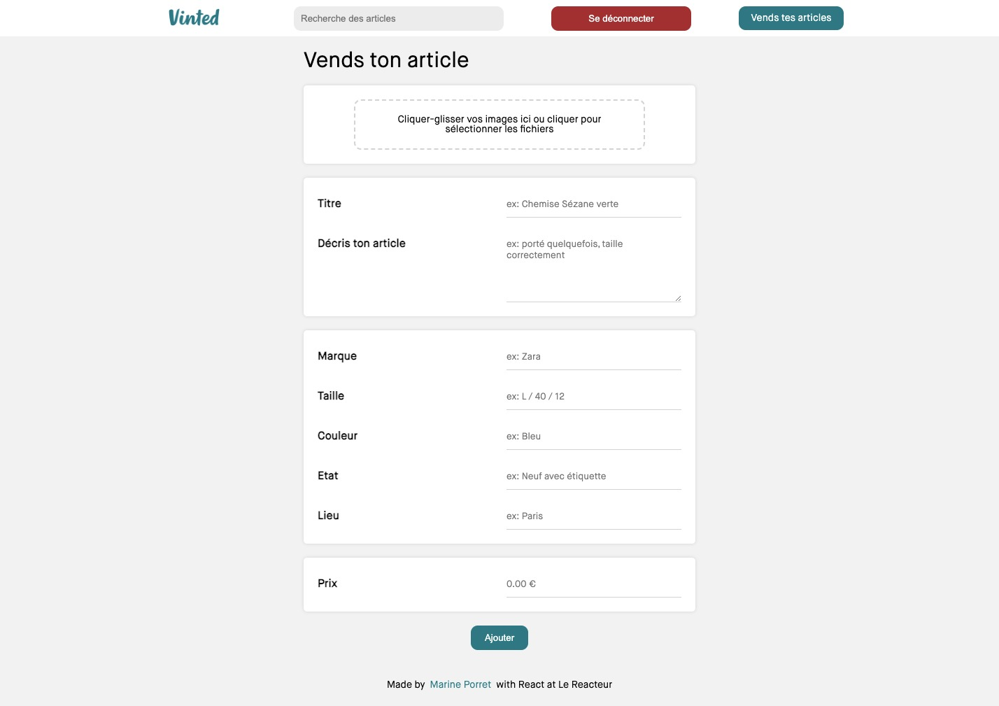

# Vinted

<a href="https://vinted-marinepo.netlify.app/" target="_blank">See the live website</a>

React (useEffect & useState), Sass, Axios

Published on netlify

## Homepage

Show all offers with filters (search by title or description, sort and price range)

Packages used :
<a href="https://github.com/markusenglund/react-switch" target="_blank">react-switch</a>
<a href="https://github.com/tajo/react-range" target="_blank">react-range</a>

## See an offer

Show the offer selected by id in URL

## SignUp

Create a new user. Show an error message if :

- a field is empty
- the email address is already used

## LogIn

Log the user with email address and password. Show an error message if :

- a field is empty
- the email address or password is incorrect

## Add an offer

Form to add an offer :
- upload images
- add a title, description and product info

Packages used :
<a href="#" target="_blank">cloudinary</a>
